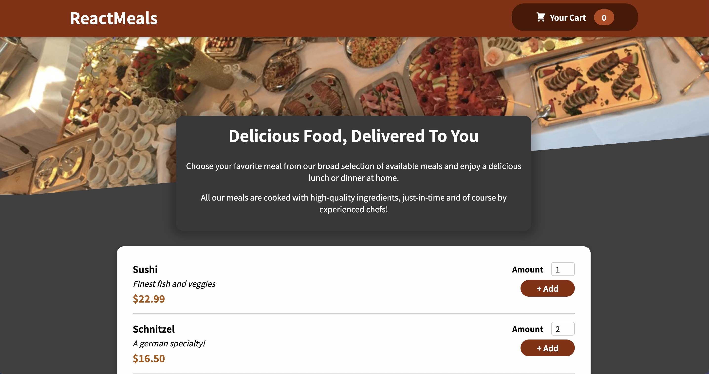
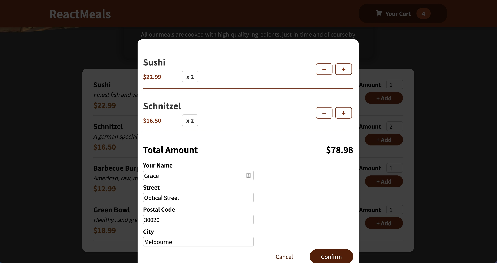
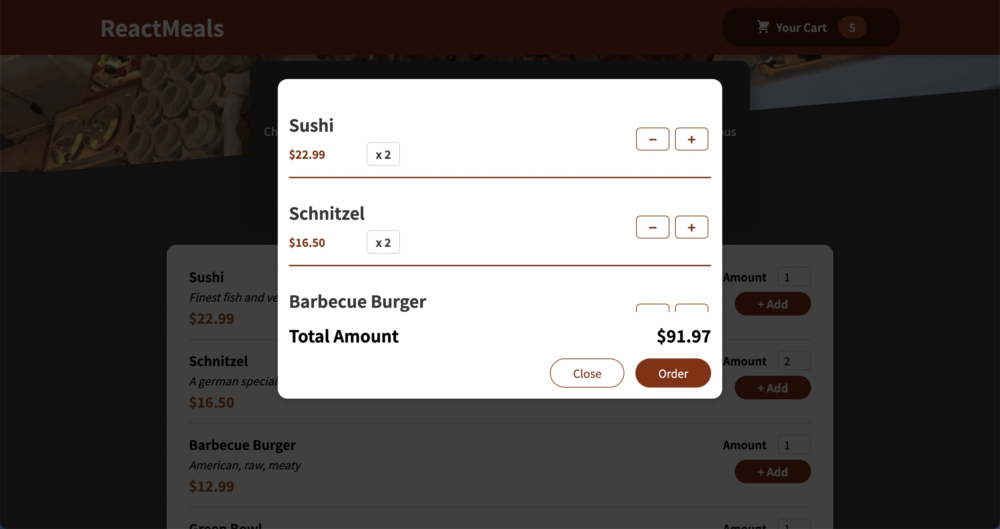
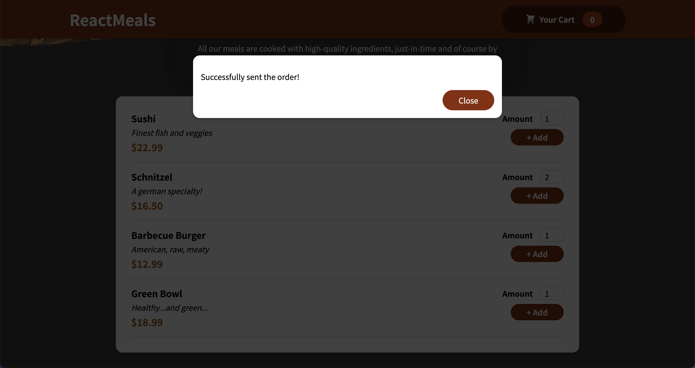

# Food Order System

  

### Description 

This project was bootstrapped with [Create React App](https://github.com/facebook/create-react-app) and has the following **highlights**.

- Adopted *Firebase Realtime Database* as data container and server.
- Rendered the order form through Portals to escape from normal DOM hierarchy.
- Implemented validation of the order form once submitting.
- Posted and saved orders to the database via *RESTful POST* method.
- Managed the view state when processing network request.
- Handled network errors by showing an error message on screen.
- Utilised *useContext* and *useReducer* to manage view state and data in the app.

| Home | Order |
| :---: | :---: |
|||
| Cart | Success |
|||
 